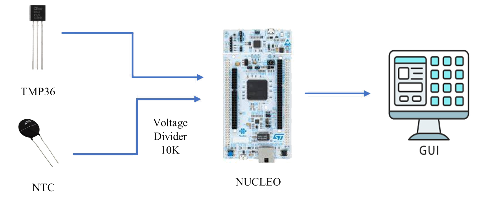
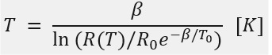
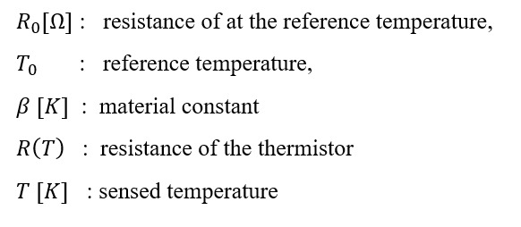
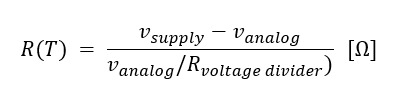
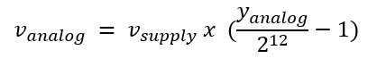
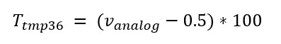
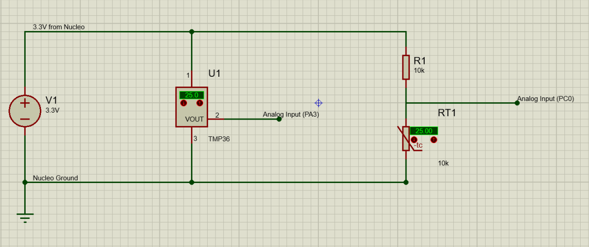
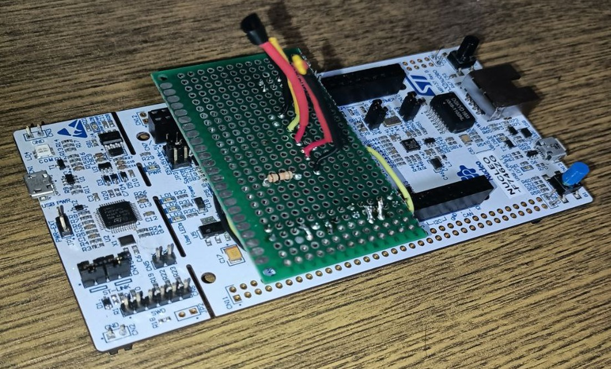
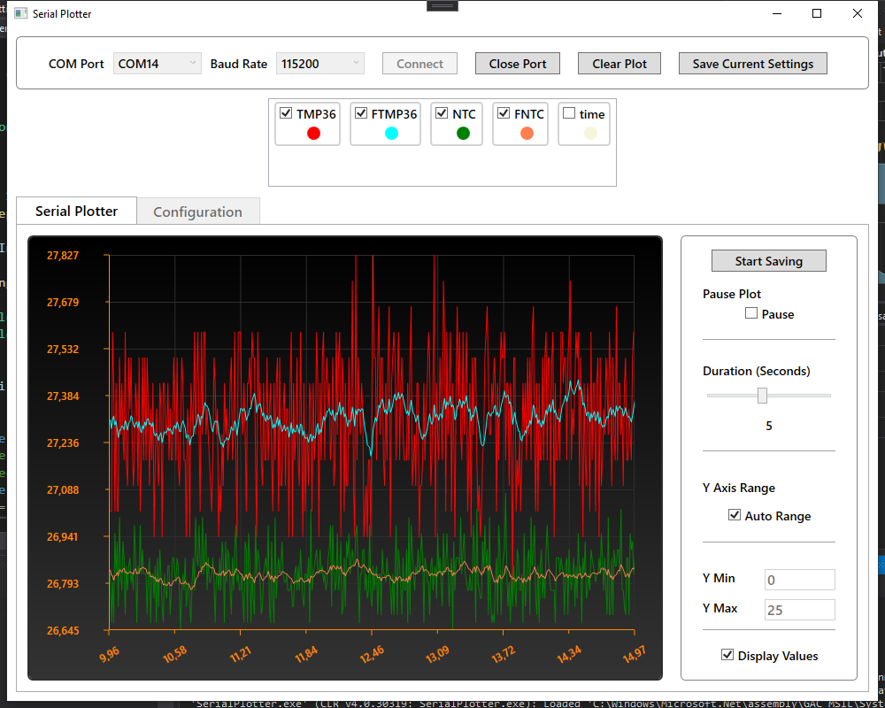
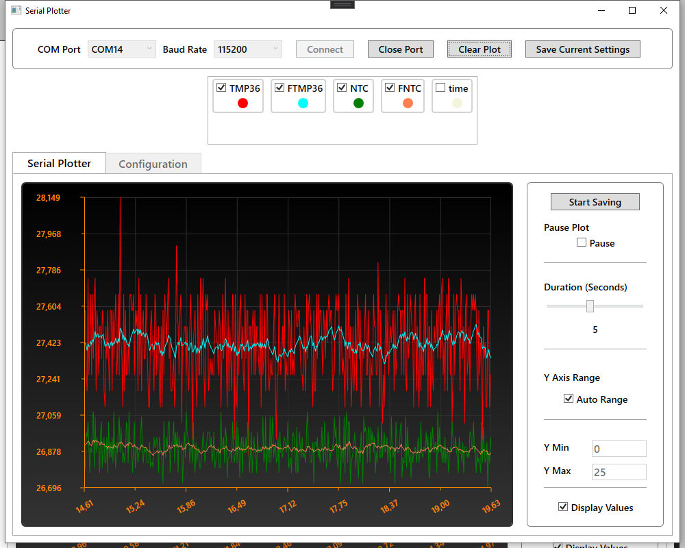


## Temperature Measurement with Fast Kalman | STM32 Nucleo Application Series

The main aim of this project is to design a stable working temperature sensor. In
this direction, using one NTC type thermistor the temperature was calculated
over the resistance value of this thermistor, which changes as a result of the
temperature. This calculated temperature is graphed in an interface with the help
of a STM32 F746 Nucleo Board. This temperature value was checked by another temperature sensor which is TMP36.

### The whole STMCubeIde project can be found in src folder

In this project, an NTC thermistor with a resistance of 10k at room temperature
(typically 25° C) was used, and a 10K resistor was used for the voltage divider
circuit. The sensor specified as a measurement as a reference is the TMP36
temperature sensor. The temperature data was read with the NUCLEO-F746ZG
processor as the processor and these data were displayed in an interface designed
with C#. 

 #### General System Diagram

 

The measured temperature value (in Kelvin) is expressed in the equation below

Parameters used in the equation are:

To measure the current resistance of Thermistor (R(T)) can be calculated as:

And the Analog Voltage value of current resistance can be measured like this:

where Vsupply = 3.3V and Analog resolution is 12 bit.

#### TMP36 sensor has a simple formula to calculate temperature value in celcius from analog voltage.

It is inferred by measuring the voltage across the change in resistance across the
thermistor so the thermistor will be used with 10 [KΩ] resistor a voltage divider
circuit. The TMP36 sensor, on the other hand, is fed directly and reading can be
made from its analog output. The circuit schematic is shown in

And the real setup is shown below:

And result can be seen in below with using C# [PhiSerialPlotter](https://github.com/PhiniteLab/phi-serial-plotter "PhiSerialPlotter") Application using UART

There is a lot of noise, especially in analog measurements. Therefore, filtering is
an indispensable part of sensor design. In this project, a filtering process was
carried out with the [FastKalmanFilter](https://github.com/PhiniteLab/fast-kalman-filter "FastKalmanFilter"). 
the algorithm estimates the state of the system and as the name suggests, while
the correction part is processed, it calculates the filter gain then ‘updates’ the
estimation with respect to the system noise. 

Website:  http://www.phinitelab.com/

Learning: https://www.udemy.com/user/phinite-academy/
